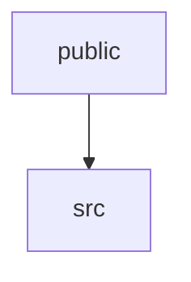

# 📚 github-breakout Documentation

Welcome to the complete documentation for this repository. This documentation is automatically generated and maintained by Woden Docbot.

   

## 🔗 Quick Links

[📂 public](./public/README.md) | [📂 src](./src/README.md)
[📋 Dependencies](./DEPENDENCIES.md)

---

> A minimal single-page generator that renders an animated Breakout-style SVG from a GitHub contribution graph and provides TypeScript HTTP helpers to serve assets and JSON.

## 📖 Overview

github-breakout is a compact web project that produces an animated Breakout-style SVG visualization driven by a GitHub contribution graph. The public directory hosts a single-page UI (index.html) that contains the client-side behavior and rendering for the animated SVG, intended to run in the browser for testing and demonstration.

Supporting the UI, the src directory provides a small TypeScript utility (server.ts) that implements HTTP server helpers used to serve static files and send JSON responses. Together, the static front end and the TypeScript HTTP helpers let a developer deploy the visualization and optionally pair it with a backend that supplies contribution data.

### 🧩 Key Components

| Component | Purpose | Technologies |
| --- | --- | --- |
| **public** | Static web root containing the single-page UI (index.html) and client-side logic to generate and render an animated Breakout-style SVG from a GitHub contribution graph. Meant to be deployed as the public-facing assets for demonstration and testing. | `HTML`, `SVG` |
| **src** | TypeScript utility module with server-side helpers (server.ts) for serving static files and producing JSON responses. Intended for reuse by server code to deliver the public assets and structured payloads to the browser. | `TypeScript`, `HTTP`, `JSON` |

**Component Architecture:**

### 🏗️ Architecture

A small, focused web setup: a static single-page UI served as public assets and a TypeScript helper module that provides HTTP helpers to serve those assets and JSON. Data flows from an HTTP server using src helpers to the browser, which renders the animated SVG from contribution data.

### 💡 Use Cases

- ✦ Render an animated Breakout-style SVG in the browser based on a GitHub contribution graph for visualization and demo purposes
- ✦ Deploy a minimal static web root (index.html) to host and test the visualization
- ✦ Use the TypeScript HTTP helpers to serve the public assets and JSON payloads that supply contribution data to the UI

### 🔧 Technologies

**Languages:** 
   

---

## 📑 Documentation Sections

### [public](./public/README.md)
Contains the static public-facing assets for generating and displaying an animated Breakout-style SVG derived from a GitHub contribution graph; primarily provides the single-page UI used in the browser.

This directory holds the static front-end asset(s) used to present a small single-page web UI that generates an animated Breakout-style SVG based on a GitHub contribution graph.

### [src](./src/README.md)
Utility module providing simple HTTP server helpers for serving static files and sending JSON responses in TypeScript.

This directory contains a single TypeScript module focused on HTTP server utilities.

---

## 📊 Documentation Statistics

- **Files Documented**: 2
- **Directories**: 3
- **Coverage**: 100%
- **Last Updated**: 2026-07-24

---

## 🧭 How to Navigate

> ℹ️ **INFO**
> Each directory has its own README.md with detailed information about that section. Use the breadcrumb navigation at the top of each page to navigate back to parent directories.

### Navigation Features

- **Breadcrumbs** - At the top of each page, showing your current location
- **Directory READMEs** - Each folder has a comprehensive overview
- **File Documentation** - Click through to individual file documentation
- **Search** - Use GitHub's search or your IDE's search functionality

---

## 🤖 About Woden DocBot

This documentation is automatically generated and kept up-to-date by Woden DocBot, an AI-powered documentation assistant. DocBot analyzes code on every pull request and updates documentation to reflect changes.

### Features

- **Automatic Updates** - Documentation updates on every PR
- **Comprehensive Coverage** - Files, functions, classes, and directories
- **Smart Navigation** - Breadcrumbs, related files, and parent links
- **AI-Powered** - Uses Azure GPT models for intelligent documentation generation

---

*Generated by Woden DocBot for github-breakout*